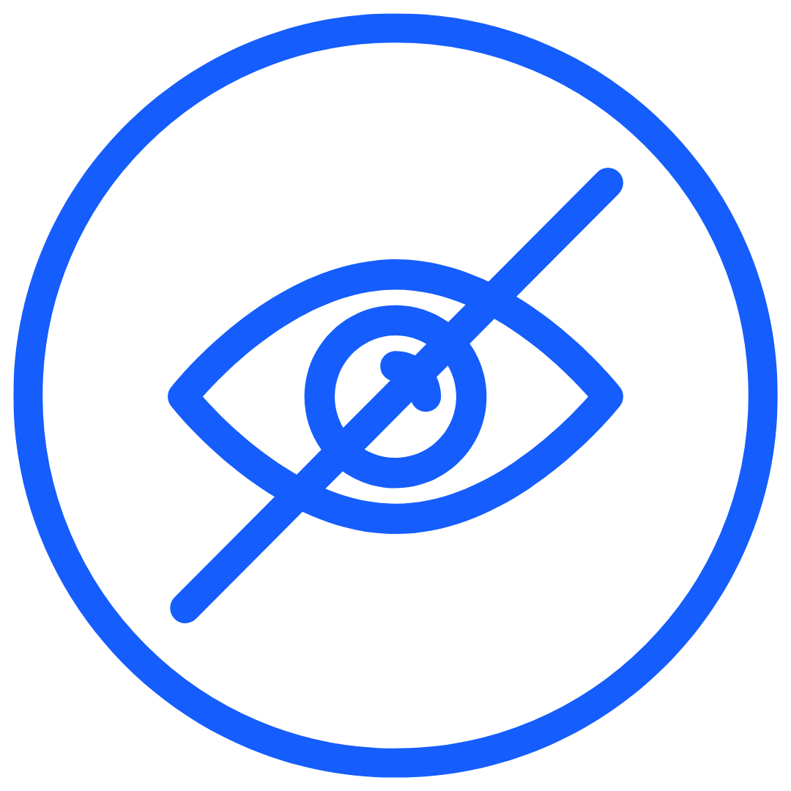

# selfX - Sosial Media Pribadi Offline

<div align="center">
  
  
  <h3>Platform sosial media pribadi yang mengutamakan privasi dengan penyimpanan 100% offline</h3>
  
  [](https://vercel.com/new/clone?repository-url=https://github.com/nafiurohman/selfx--sosial-media-pribadi)
  [](https://opensource.org/licenses/MIT)
  [](https://web.dev/progressive-web-apps/)
</div>

## 🌟 Fitur Utama

### 🔒 **Privasi Absolut**
- **100% Offline**: Semua data tersimpan di perangkat pengguna
- **Tidak ada server backend**: Tidak ada data yang dikirim ke server
- **Enkripsi multi-layer**: AES-256-GCM dengan signature khusus
- **Kontrol penuh**: Pengguna memiliki kontrol penuh atas data mereka
- **Tanpa tracking**: Tidak ada analytics, cookies, atau pelacakan aktivitas

### 📱 **Progressive Web App (PWA)**
- **Install sebagai aplikasi**: Dapat diinstall di Android, iOS, dan Desktop
- **Offline-first**: Bekerja sepenuhnya tanpa koneksi internet
- **Responsive design**: Optimal di semua ukuran layar
- **Native-like experience**: Performa seperti aplikasi native

### 🎨 **Fitur Lengkap**
- **Multi-format media**: Foto dan video dengan 3 opsi dimensi (4:5, 1:1, original)
- **Transparansi gambar**: Mendukung PNG dengan background transparan
- **Sistem komentar**: Interaktif dengan toggle show/hide
- **Bookmark dengan kategori**: Organisasi konten yang fleksibel
- **Sharing terenkripsi**: Berbagi post antar pengguna dengan enkripsi end-to-end
- **Dark/Light mode**: Tema yang dapat disesuaikan
- **Export/Import**: Backup dan restore data terenkripsi

### ✍️ **Fitur Cerita (Stories)**
- **Editor lengkap**: Menulis cerita panjang dengan editor yang nyaman
- **Kategori cerita**: Organisasi cerita berdasarkan kategori (Senang, Sedih, dll)
- **Karakter & Outline**: Tab terpisah untuk mengembangkan karakter dan outline cerita
- **Auto-save**: Penyimpanan otomatis saat menulis
- **Sharing terenkripsi**: Berbagi cerita dengan enkripsi AES-256 multi-layer
- **Import/Export cerita**: Backup dan restore cerita secara terpisah
- **Statistik cerita**: Jumlah karakter dan estimasi waktu baca
- **CRUD lengkap**: Create, Read, Update, Delete cerita dengan mudah

## 🚀 Demo

**Live Demo**: [https://selfx.bezn.web.id](https://selfx.bezn.web.id)

## 📋 Persyaratan Sistem

- **Browser Modern** dengan dukungan:
  - IndexedDB
  - Web Crypto API
  - Service Workers
  - ES2020+
- **Minimum Browser Versions**:
  - Chrome 88+
  - Firefox 84+
  - Safari 14+
  - Edge 88+

## 🛠️ Teknologi

- **Frontend**: React 18 + TypeScript
- **Build Tool**: Vite
- **Styling**: Tailwind CSS + shadcn/ui
- **Animations**: Framer Motion
- **Database**: IndexedDB (via idb)
- **Encryption**: Web Crypto API (AES-256-GCM)
- **PWA**: Vite PWA Plugin

## 📁 Struktur Project

```
selfx/
├── public/
│   ├── images/logo/          # Logo aplikasi
│   ├── manifest.json         # PWA manifest
│   └── sw.js                # Service worker
├── src/
│   ├── components/          # React components
│   │   ├── ui/             # shadcn/ui components
│   │   ├── PostCard.tsx    # Komponen post
│   │   ├── Navigation.tsx  # Navigasi
│   │   └── ...
│   ├── pages/              # Halaman aplikasi
│   │   ├── Feed.tsx        # Timeline utama
│   │   ├── Profile.tsx     # Halaman profil
│   │   ├── Stories.tsx     # Halaman cerita
│   │   ├── StoryEditor.tsx # Editor cerita
│   │   └── ...
│   ├── lib/                # Utilities & logic
│   │   ├── db.ts          # Database operations
│   │   ├── crypto.ts      # Enkripsi functions
│   │   ├── storyEncryption.ts # Enkripsi khusus cerita
│   │   ├── types.ts       # TypeScript types
│   │   └── ...
│   ├── hooks/              # Custom React hooks
│   └── App.tsx            # Root component
├── vercel.json             # Vercel configuration
├── vite.config.ts         # Vite configuration
└── package.json
```

## 🔧 Konfigurasi

### Vercel Configuration (`vercel.json`)
```json
{
  "rewrites": [
    {
      "source": "/(.*)",
      "destination": "/index.html"
    }
  ],
  "headers": [
    {
      "source": "/sw.js",
      "headers": [
        {
          "key": "Cache-Control",
          "value": "public, max-age=0, must-revalidate"
        }
      ]
    }
  ]
}
```

### PWA Configuration
- **Manifest**: `public/manifest.json`
- **Service Worker**: `public/sw.js`
- **Icons**: `public/images/logo/`

## 🔐 Keamanan & Privasi

### Enkripsi
- **Algorithm**: AES-256-GCM
- **Key Derivation**: PBKDF2 dengan 100,000 iterasi
- **Salt**: Random 16 bytes per layer
- **Layers**: 3 layer enkripsi untuk backup
- **Signature**: Validasi khusus selfX untuk autentikasi
- **Story Encryption**: Enkripsi terpisah untuk cerita dengan signature selfX-story-encrypted-v2.0

### Data Storage
- **Local**: IndexedDB + LocalStorage
- **No Server**: Tidak ada data yang dikirim ke server
- **No Tracking**: Tidak ada analytics atau tracking
- **No Cookies**: Tidak menggunakan cookies untuk tracking

## 📱 Fitur PWA

### Installasi
1. Buka aplikasi di browser
2. Klik "Install" di prompt atau menu browser
3. Aplikasi akan terinstall seperti aplikasi native

### Offline Support
- **Full Offline**: Bekerja tanpa internet setelah instalasi
- **Cache Strategy**: Cache-first untuk aset statis
- **Background Sync**: Tidak diperlukan karena offline-first

## 🎯 Use Cases

### Personal Journaling
- Catatan harian pribadi
- Refleksi dan pemikiran
- Dokumentasi momen penting

### Creative Writing
- Menulis cerita pendek atau novel
- Mengembangkan karakter dan plot
- Menyimpan ide-ide kreatif

### Private Social Media
- Alternatif akun kedua Twitter/Instagram
- Sharing dengan circle terbatas
- Konten yang tidak ingin dipublikasi

### Content Creation
- Draft postingan
- Ide dan inspirasi
- Portfolio pribadi

## 📞 Kontak Bezn

- **Email**: support@beznproject.web.id
- **WhatsApp**: 085189643588
- **Website**: [beznproject.web.id](https://beznproject.web.id)
- **Instagram**: [beznp.roject](https://instagram.com/bezn.project)

## 📞 Kontak Developer

- **Email**: nafiurohman25@gmail.com
- **WhatsApp**: 081358198565
- **Website**: [nafiurohman.pages.dev](https://nafiurohman.pages.dev)
- **Instagram**: [nafiurohman_](https://instagram.com/nafiurohman_)


## 💰 Donasi

Jika selfX bermanfaat untuk Anda, dukung pengembangan dengan donasi:

**Bank Jago**  
No. Rekening: `507938016692`  
a.n M. Nafiurohman

## 📄 Lisensi

Distributed under the MIT License. See `LICENSE` for more information.

## 👨💻 Developer

**M. Nafiurohman**
- Website: [nafiurohman.pages.dev](https://nafiurohman.pages.dev)
- Email: nafiurohman25@gmail.com
- GitHub: [@nafiurohman](https://github.com/nafiurohman)
- LinkedIn: [nafiurohman](https://linkedin.com/in/nafiurohman)
- Instagram: [@nafiurohman_](https://instagram.com/nafiurohman_)
- TikTok: [@nafiurohman_](https://tiktok.com/@nafiurohman_)

## 🏢 Bezn Project

selfX adalah bagian dari **Bezn Project** - inisiatif pengembangan aplikasi yang berfokus pada privasi dan keamanan pengguna.

### Platform Lainnya
- [Money Record](https://moneyrecord.web.id) - Aplikasi pencatat keuangan
- [Ezzy](https://ezzy.my.id) - Platform produktivitas
- [CV Maker](https://cv-maker.bezn.web.id) - Pembuat CV online

### Ekosistem Bezn
- [Bezn Platform](https://beznproject.web.id/platform) - Platform utama
- [Bezn Studio](https://studio.beznproject.web.id) - Studio pengembangan
- [Bezn Labs](https://beznlabs.web.id) - Laboratorium inovasi

## 🙏 Acknowledgments

- [React](https://reactjs.org/) - UI Library
- [Vite](https://vitejs.dev/) - Build Tool
- [Tailwind CSS](https://tailwindcss.com/) - CSS Framework
- [shadcn/ui](https://ui.shadcn.com/) - UI Components
- [Framer Motion](https://www.framer.com/motion/) - Animation Library
- [Lucide React](https://lucide.dev/) - Icon Library

---

<div align="center">
  <p>by <a href="https://beznproject.web.id">Bezn Project</a></p>
  <p>© 2025 M. Nafiurohman. All rights reserved.</p>
</div>